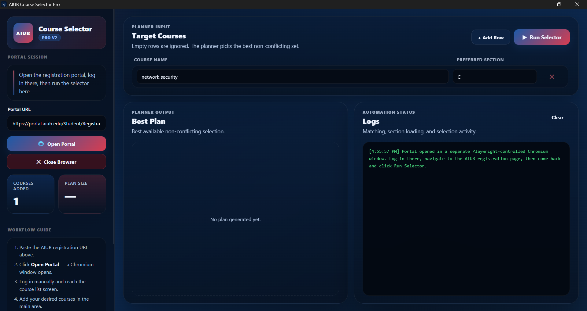
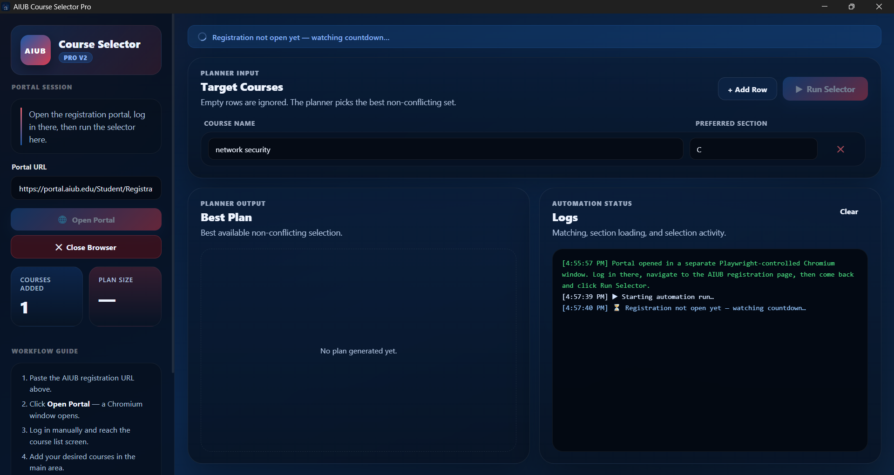
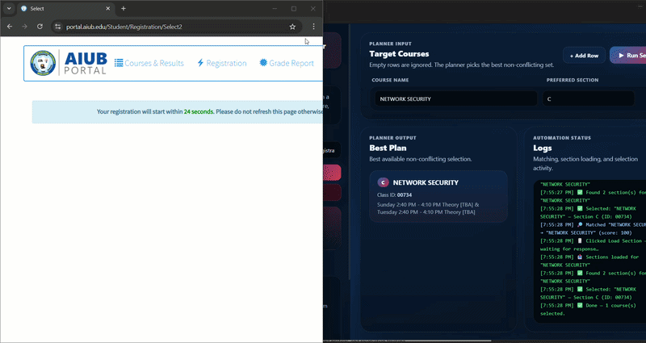

# AIUB Course Selector Pro

Desktop application for helping AIUB students select course sections and generate better routines with fewer time conflicts.

## Download

### Latest version
[Download the latest release](https://github.com/ShahriyarH10/aiub-course-selector-pro/releases/latest)

### Direct downloads
- [Windows Installer](https://github.com/ShahriyarH10/aiub-course-selector-pro/releases/latest/download/AIUB-Course-Selector-Pro-Setup.exe)
- [Windows Portable](https://github.com/ShahriyarH10/aiub-course-selector-pro/releases/latest/download/AIUB-Course-Selector-Pro-Portable.exe)
- [macOS DMG](https://github.com/ShahriyarH10/aiub-course-selector-pro/releases/latest/download/AIUB-Course-Selector-Pro.dmg)
- [macOS ZIP](https://github.com/ShahriyarH10/aiub-course-selector-pro/releases/latest/download/AIUB-Course-Selector-Pro-mac.zip)

## Features
- Desktop GUI for course selection support
- Routine generation
- Time clash detection
- Preferred section and class matching
- Better plan summary and logs
- Windows and macOS builds

## Screenshots
the screenshots and gif added below for better understanding.

### Main Window

### Log View

### Working View

## Notes
- Download only from this repository’s Releases page.
- Windows users should normally use the installer version.
- The portable Windows version can be used without installation.
- macOS users may see a security warning if the app is unsigned or not notarized.

## Issue Reporting
If you find a bug or want to request a feature, open an issue in this repository.